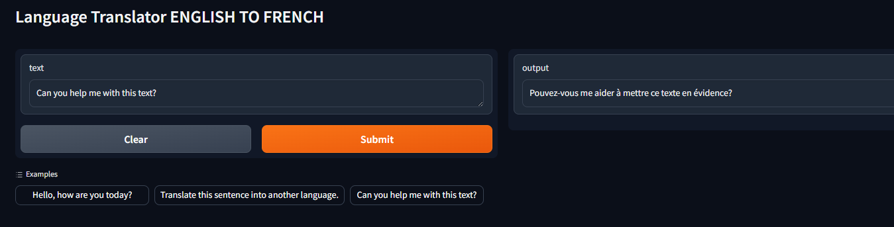

# Language Translator with Gradio Interface

## Overview

This project implements a language translator with a user-friendly interface using Gradio. The model has been fine-tuned on a custom dataset to translate English sentences to French. The deployed model utilizes the "google-t5/t5-small" architecture.

## Model Link

Interact with the model on Hugging Face Spaces: [Translator Model](https://huggingface.co/spaces/suriya7/English-French)

## Features

- Gradio interface for easy interaction.
- Fine-tuned "google-t5/t5-small" model for English to French translation.
- Python implementation for flexibility.
- Hugging Face deployment for accessibility.

## Dataset

[dataset link](https://huggingface.co/datasets/opus_books)

The model has been fine-tuned on a custom dataset containing pairs of English and French sentences. Ensure your translation needs align with the scope of the fine-tuning dataset.


## Requirements

Ensure you have the following prerequisites installed:

- Python
- Gradio
- Hugging Face Transformers

## Usage

1. Clone the repository:

   ```bash
    https://github.com/theSuriya/Language-Translator.git
   
## Screenshots


